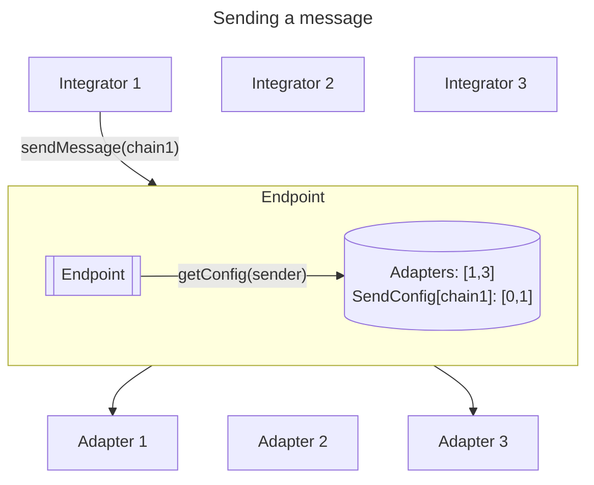
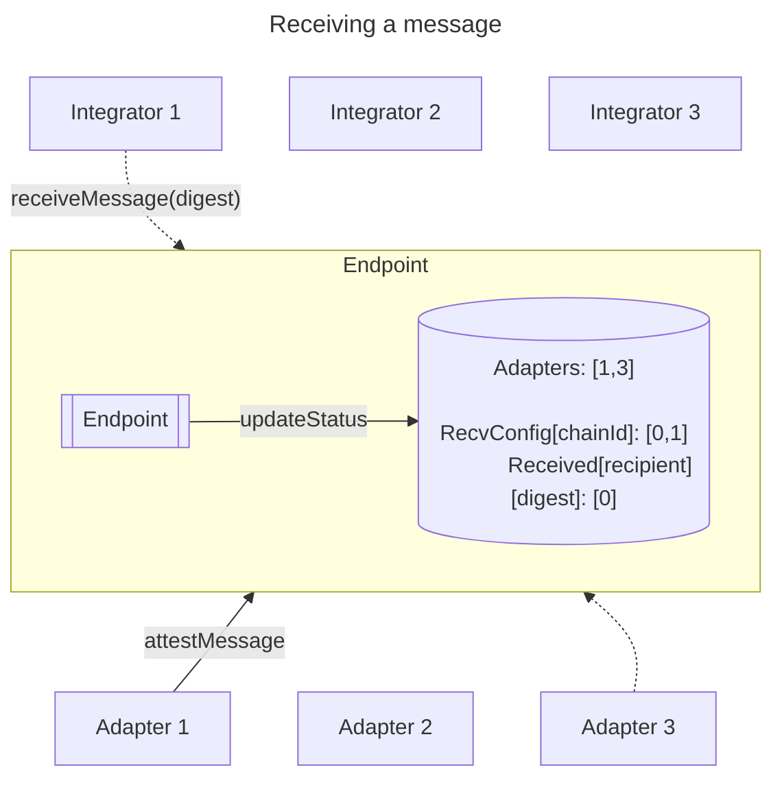

# Modular Messaging (MM)

## Objective

Provide a protocol agnostic framework for sending and receiving messages that supports flexible path configuration and opt-in upgradeability. The on-chain infrastructure and standardized off-chain components should be provided to minimize integrator effort and responsibility.

## Runtime Support

- [ ] [EVM](https://ethereum.org/en/developers/docs/evm/)
- [ ] [SVM](https://solana.com/developers/evm-to-svm/smart-contracts)
- [ ] [Sui Move](https://sui.io/move)
- [ ] [Aptos Move](https://aptos.dev/en/build/smart-contracts)

## Development

See [DEVELOP.md](./DEVELOP.md).

## Background

The [Wormhole Core](https://github.com/wormhole-foundation/wormhole/blob/main/whitepapers/0001_generic_message_passing.md) bridge offers very flexible and relatively un-opinionated generic message passing. The cost of that flexibility is that it does not inherently provide several widely required integrator features, such as an explicit destination chain and address or replay protection. It is essentially a message attestation and verification protocol only. This leaves all integrators who wish to build unicast messaging implementations to implement this themselves.

[Wormhole's Native Token Transfers](https://github.com/wormhole-foundation/example-native-token-transfers) (NTT) is a framework for integrators to transfer tokens across chains via independent NttManager contract deployments which may leverage multiple Transceivers - a standardized messaging protocol abstraction. The NttManager contract is responsible for transfers of a single token (locking/burning, minting/unlocking), sending/receiving messages via multiple Transceivers, and managing those Transceivers. Today, each integrator must deploy and configure Transceivers themselves. For a Wormhole Transceiver, this includes cross-registering the Manager on the same chain and cross-registering the Transceivers on the other chains.

A marquee feature of NTT is its messaging protocol abstraction, allowing integrators to lever up security or resiliency by choosing multiple transceivers in m of n configurations. For example, Lido chose to use Wormhole and Axelar in a 2-of-2 configuration, and there has been [NTT-specific work](https://github.com/wormhole-foundation/example-native-token-transfers/pull/517) to increase the flexibility of these configurations.

There are many possible messaging products and improvements that exist today or could exist in the future: threshold signatures greatly reducing verification costs, zero-knowledge proofs improving trustlessness, batching messages to improve throughput and decrease cost. However, there does not exist a standardized way to opt-in to adoption of these new improvements.

## Goals

Provide a protocol agnostic framework for sending and receiving messages that supports flexible path configuration and opt-in upgradeability. The on-chain infrastructure and standardized off-chain components should be provided to minimize integrator effort and responsibility.

- A non-upgradeable, non-administrated/owned **Endpoint** which manages integrator Adapter configuration and message state. This abstracts Adapters from Integrators. The goal of the Endpoint is to provide strictly the functionality necessary for agnostically generating and aggregating attestations across multiple protocols.
- An opinionated standard for **Adapter** design. The intention is for these to be safe to share and trust across integrators. The goal of an Adapter is to interface between the Endpoint and a particular messaging / attestation protocol. These are the equivalent of NTT's Transceivers.
- A 1-1 generic messaging framework where on-chain integrators only need to interact directly with one contract for attestation.
- Allow Integrators to define their own, custom thresholding logic.
- Lay the ground work for trustless execution, completely separate from attestation.

Any implementation should prioritize

- Documentation (APIs, wire formats, deployment, verification)
- Testing (aiming for 100% code coverage where possible and complete integration/e2e testing)
- Permissionless-ness and immutability where possible
- Composability
- Discoverability (e.g. off-chain code can determine what configuration and versions on-chain code is using)

## Non-Goals

- Handling complex thresholding logic in the Endpoint.
  - No one size fits all solution. Instead, expose a way for Integrators to define their own rules on their side.
- Managing peers in the Endpoint.
  - This would introduce Integrator/application-specific logic into the Endpoint and make it more difficult for an Integrator to migrate to a new Endpoint. It is more appropriate for accepted peers to be configured at the application level (though standard libraries can be provided for this).
- Pass-through parameters specific to an Adapter.
- Message execution.
- Generically solving relaying on all runtimes.
- Arbitrarily large size messages.
- Advanced messaging patterns, such as efficient 1-n messaging.
- Time-lock administrative functions. Since the admin can be another on-chain contract, time locks or any other desired governance restrictions can be performed there.

## Overview





## Detailed Design

Broadly, the design is to split the generic message passing and adapter logic from NTT into a sharable piece of infrastructure, referred to here as Endpoint. For this to be effective, Adapters must adhere to a stricter design standard.

All implementations should prioritize the following best practices:

- Minimize the number of functions / instructions that modify the same state
- Minimize branching logic
- Revert with unique errors for each unique condition

### Technical Details

#### Terminology

> The following variable / parameter naming conventions are in camel case and should be adapted to the implementation's programming language standards accordingly.

Admin - `admin` - The designated public key / address / etc (as applicable to the given runtime) which can perform the administrative functions on behalf of an Integrator.

Message - `message` - A cross-chain message, consisting of a Source Chain and Address, Sequence, Destination Chain and Address, and Payload. The Endpoint only attests to the hash of that Payload.

Source Chain - `srcChain` - The Wormhole Chain ID (`u16`) of the sending / emitting chain.

Source Address - `srcAddr` - The UniversalAddress (`bytes32`) representation (according to the Wormhole specification) of the sending Integrator address.

Sequence - `sequence` - The auto-incremented `u64` on each message sent by an Integrator

Destination Chain - `dstChain` - The Wormhole Chain ID (`u16`) of the intended recipient chain.

Destination Address - `dstAddr` - The UniversalAddress (`bytes32`) representation of the intended recipient Integrator address.

Payload - `payload` - A message payload of arbitrary bytes, encoded by the Integrator, intended to reach the destination chain / address.

Payload Hash - `payloadHash` - The `keccak256` (`bytes32`) of the message `payload`.

Message Hash - `messageHash` - The `keccak256` (`bytes32`) of the concatenated `srcChain`, `srcAddr`, `sequence`, `dstChain`, `dstAddr`, `payloadHash` (in that order).

Send Adapter - `sendAdapter` - An Adapter enabled to send messages for a given Integrator _to_ a given Destination Chain.

Receive Adapter - `recvAdapter` - An Adapter enabled to attest to messages for a given Integrator _from_ a given Source Chain.

Outstanding Adapter - `outstandingAdapter` - On implementations which require Adapters to pull outgoing messages, a Send Adapter _at the time of message generation_ which has not yet picked up a given message.

#### Endpoint

- MUST be non-upgradeable, non-"pause"-able, and non-administrated/owned. It should be able to be trusted by being completely trustless.
- MUST store configuration per-integrator.
- MUST support initial Integrator registration to configure an administrator.
- MUST support transferring administrator, including explicitly discarding it [*admin only*].
  - MUST support two-step admin transfer, where the new administrator MAY accept the transfer OR the existing administrator MAY cancel the transfer.
  - MUST also support one-step admin transfer, where the new administrator immediately replaces the admin. This may be used to better support emergency-only multi-sigs or governance contracts which are not-yet complete or their governance does not wish to explicitly issue an acceptance.
- MUST support 128 Adapters, per-integrator, in an append-only fashion [*admin only*].
- MUST configure send and receive Adapters independently, per-chain [*admin only*].
- MUST track an unsigned 64-bit sequence number per-integrator.
- MUST handle replay protection for the Integrator.
- MUST handle replay protection on attestations for an Adapter.
- MUST allow additional attestations on messages which have been executed.
- MUST allow for the integrator to perform custom thresholding logic.
- MUST allow for integrators to add any Adapter to their configuration.
- MUST allow for off-chain configuration discoverability.
- MUST NOT handle message execution, so as to provide for a clear separation of concerns. Message execution can be handled via a disparate relaying protocol.

#### Adapters

- MUST be non-upgradeable.
- MUST be append-only (i.e. existing configuration cannot be changed once set).
- MUST be associated with EXACTLY one Endpoint.
- SHOULD avoid branching logic. They should serve exactly one, direct purpose.
- SHOULD be non-administered, if possible (e.g. OP Stack Native Bridge).
- SHOULD automatically relay attestations.

#### Integrators

- MUST initially register with the Endpoint to reserve any necessary state and set their admin, which MAY be their own address.

#### Message Flow

Generally, messages make the following journey:

- Send [on the *source* chain]
  - An Integrator pushes the message payload hash and recipient (destination chain and address) to the Endpoint.
  - The Endpoint provides the payload and metadata to the configured Adapters for that destination chain.
  - Each Adapter serializes the message info and sends it to a corresponding Adapter on the destination chain via their protocol.
- Attest [off-chain - the *destination* chain]
  - Each protocol posts the message to the destination chain Adapter which verifies the message and submits its attestation to the Endpoint
- Receive [on the *destination* chain]
  - A relayer executes the Integrator which _pulls_ the attestations from the Endpoint, marking the message as received.

### API / database schema

#### Endpoint

The Endpoint MUST store the following information.

```solidity
// Integrator => config
mapping(address => IntegratorConfig) perIntegratorConfig;

// This may look different depending on the chain, on EVM something like this
// is necessary to determine the difference between an unregistered integrator
// and one who has discarded their admin (set it to the 0 address).
struct IntegratorConfig {
  bool isInitialized;
  address admin;
}

// Integrator => an array of Adapters, max length 128
mapping(address => address[]) perIntegratorAdapters;

// Integrator (message sender) => chainId => bitmap corresponding to index in perIntegratorAdapters
mapping(address => mapping(uint16 => uint128)) perIntegratorPerChainSendAdapters;
// OR Integrator (message sender) => chainId => array of Adapter addresses
// whichever is most efficient (e.g. on Ethereum it is better to pre-compute
// the array whereas Solana needs to track which adapter has picked up a message)
mapping(address => mapping(uint16 => address[])) perIntegratorPerChainSendAdapters;

// Integrator (message recipient) => chainId => bitmap corresponding to index in perIntegratorAdapters
mapping(address => mapping(uint16 => uint128)) perIntegratorPerChainRecvAdapters;

// Integrator (message sender) => sequence number
mapping(address => uint64) perIntegratorSequence;

// Integrator (message recipient) => message digest -> attestation info
mapping(address => mapping(bytes32 => AttestationInfo)) perIntegratorAttestations;

struct AttestationInfo {
  bool executed;                // replay protection
  uint128 attestedAdapters; // bitmap corresponding to perIntegratorAdapters
}
```

When sending a message, the Endpoint MUST provide the Adapters with the following information.

```solidity
bytes32 sourceAddress      // UniversalAddress of the message sender (integrator)
uint64  sequence           // Next sequence number for that integrator (consuming the sequence number)
uint16  destinationChainId // Wormhole Chain ID
bytes32 destinationAddress // UniversalAddress of the message recipient (integrator on destination chain)
bytes32 payloadHash        // keccak256 of arbitrary payload from the integrator
```

When attesting to (receiving) a message, the Adapter MUST provide the Endpoint with the following information.

```solidity
uint16  sourceChain        // Wormhole Chain ID
bytes32 sourceAddress      // UniversalAddress of the message sender (integrator)
uint64  sequence           // Next sequence number for that integrator (consuming the sequence number)
uint16  destinationChainId // Wormhole Chain ID
bytes32 destinationAddress // UniversalAddress of the message recipient (integrator on destination chain)
bytes32 payloadHash        // keccak256 of arbitrary payload from the integrator
```

The Endpoint MUST calculate the message digest as

```solidity
keccak256(abi.encodePacked(sourceChain, sourceAddress, sequence, destinationChain, destinationAddress, payloadHash));
```

Generally, Integrators (and the public) will require getters (as applicable) for all state.

Every one of the following methods MUST generate traceable events.

The Endpoint MUST contain the following functionality for an Integrator:

- `register(initialAdmin)`
  - MUST check that the caller (Integrator) is not already registered.
  - If possible, MUST check that the admin is potentially valid / non-null (e.g. `initialAdmin != address(0)` on EVM).
  - In general, it is up to the Integrator to ensure the validity of the admin address.
  - Initializes their registration and sets the initial admin.
- `sendMessage(dstChain, dstAddr, payloadHash)` → `sequence`
  - MUST have at least one enabled **send** Adapter for `dstChain`.
  - Increments the Integrator's sequence and performs the steps to send the message or prepare it for sending, as applicable.
  - If Adapters must pull outgoing messages in the given implementation (via `pickUpMessage`), the Endpoint MUST set the current enabled Send Adapters as the Outstanding Adapters for that message.
- `getMessageStatus(srcChain, srcAddr, sequence, dstChain, dstAddr, payloadHash)` → `enabledBitmap, attestedBitmap, executed`
  - Returns the enabled receive Adapters for that chain along with the attestations and the executed flag.
- `recvMessage(srcChain, srcAddr, sequence, dstChain, dstAddr, payloadHash)` → `enabledBitmap, attestedBitmap`
  - MUST check that at least one Adapter has attested.
  - MUST revert if already executed.
  - Marks the message as executed and returns the enabled receive Adapters for that chain along with the attestations.
  - NOTE: for efficiency, this combines `getMessageStatus` and `execMessage` into one call and is expected to be the primary way that Integrators receive messages.
    - If they do not wish for the Endpoint to perform replay protection, they may simply use `getMessageStatus`.
    - If they need to explicitly mark a message as executed regardless of its attestation state, they may use `execMessage`.
- `execMessage(srcChain, srcAddr, sequence, dstChain, dstAddr, payloadHash)`
  - MUST revert if already executed.
  - MUST NOT require any Adapters to have attested
  - Marks the message as executed.

The Endpoint MUST contain the following functionality for an Adapter

- `attestMessage(srcChain, srcAddr, sequence, dstChain, dstAddr, payloadHash)`
  - MUST check that the Adapter is an enabled **receive** Adapter for the Integrator (`dstAddr`) and **source** chain (`srcChain`).
  - MUST check that the Adapter has NOT already attested.
  - MUST allow an Adapter to attest after message execution.
  - Calculates the message hash and marks the Adapter as having attested to the message.

The Endpoint MAY contain the following functionality for an Adapter, if the implementation cannot arbitrarily call `sendMessage` on an Adapter (e.g. Solana, Sui, Aptos).

- `pickUpMessage(srcAddr, sequence)` → `dstChain, dstAddr, payloadHash`
  - MUST check that the Adapter is an enabled **send** Adapter for the Integrator (`srcAddr`) and **destination** chain (`dstChain`).
  - MUST check that the Adapter has NOT already picked up the message.
  - Marks the Adapter as having picked up the message.
  - In order to reduce integrator / user costs, upon the last enabled sending Adapter's pickup, any outgoing message state MUST be cleared.

The Endpoint MUST contain the following functionality for an Admin

- `updateAdmin(integratorAddr, newAdmin)`
  - MUST check that the caller is the current admin and there is not a pending transfer.
  - If possible, MUST NOT allow the admin to discard admin via this command (e.g. `newAdmin != address(0)` on EVM).
  - Immediately sets `newAdmin` as the admin of the integrator.
- `transferAdmin(integratorAddr, newAdmin)`
  - MUST check that the caller is the current admin and there is not a pending transfer.
  - If possible, MUST NOT allow the admin to discard admin via this command (e.g. `newAdmin != address(0)` on EVM).
  - Initiates the first step of a two-step process in which the current admin (to cancel) or new admin must claim.
- `claimAdmin(integratorAddr)`
  - MUST check that the caller is the current admin OR the pending admin.
  - MUST check that there is an admin transfer pending (e.g. pendingAdmin != address(0) on EVM).
  - Cancels / Completes the second step of the two-step transfer. Sets the admin to the caller and clears the pending admin.
- `discardAdmin(integratorAddr)`
  - MUST check that the caller is the current admin and there is not a pending transfer.
  - Clears the current admin. THIS IS NOT REVERSIBLE. This ensures that the Integrator configuration becomes immutable.
- `addAdapter(integratorAddr, adapterAddr)`
  - MUST check that the caller is the current admin and there is not a pending transfer.
  - MUST check that `adapterAddr` is not already in the array.
  - MUST check that the array would not surpass 128 entries.
  - Appends the `adapterAddr` to the Integrator's array of Adapters. THIS IS NOT REVERSIBLE. Once an adapter is added for an Integrator, it cannot be removed.
  - Note: When an Adapter is added, it is not enabled for sending or receiving on any chain.
- `enableSendAdapter(integratorAddr, chain, adapterAddr)`
  - MUST check that the caller is the current admin and there is not a pending transfer.
  - MUST check that the `adapterAddr` is in the Integrator's array of Adapters.
  - MUST check that the `adapterAddr` is currently disabled for sending to the given chain.
  - Enables the Adapter for sending to the given chain.
- `disableSendAdapter(integratorAddr, chain, adapterAddr)`
  - MUST check that the caller is the current admin and there is not a pending transfer.
  - MUST check that the `adapterAddr` is in the Integrator's array of Adapters.
  - MUST check that the `adapterAddr` is currently enabled for sending to the given chain.
  - Disables the Adapter for sending to the given chain.
- `enableRecvAdapter(integratorAddr, chain, adapterAddr)`
  - MUST check that the caller is the current admin and there is not a pending transfer.
  - MUST check that the `adapterAddr` is in the Integrator's array of Adapters.
  - MUST check that the `adapterAddr` is currently disabled for receiving from the given chain.
  - Enables the Adapter for receiving from the given chain.
- `disableRecvAdapter(integratorAddr, chain, adapterAddr)`
  - MUST check that the caller is the current admin and there is not a pending transfer.
  - MUST check that the `adapterAddr` is in the Integrator's array of Adapters.
  - MUST check that the `adapterAddr` is currently enabled for receiving from the given chain.
  - Disables the Adapter for receiving from the given chain.

## Caveats

### Non-Upgradeable, Non-Pause-able, Append-Only

The purpose of the Endpoint is to be a protocol agnostic, shared piece of on-chain infrastructure. As such, it must not, itself, inherit the security risks of any of the protocols an integrator might choose. For example, if the Endpoint were to be governed by Wormhole governance, a Wormhole governance related exploit could make an Integrator vulnerable to the exact risk they were attempting to avoid by choosing a 2-of-2 with Axelar and Wormhole. Furthermore, the Endpoint may be used by Integrators to perform cross-chain governance. For example, it is possible that they could be in a position where they require a working, but potentially vulnerable, Adapter in order to switch their configuration to a new one.

The append-only requirement refers to items in arrays or maps which, once added, cannot be removed. This is critical to the ensure acceptable trust criteria for Integrators. For example, once an Adapter admin sets a peer Adapter on another chain, they MUST not be able to change it. Allowing this would mean that once an Adapter becomes used by an Integrator, an admin could switch the peer from the reviewed one (which the Integrator accepted the risk of) to one controlled by the admin (or their exploiter), targeting any Integrator functionality controlled by this Adapter.

### Chain ID

In order for the Endpoint and Adapters to function across a myriad of chains, protocols, and runtimes, there must exist agreed upon universal chain identification system. This design uses the [Wormhole Chain ID](https://github.com/wormhole-foundation/wormhole/blob/main/whitepapers/0001_generic_message_passing.md#security-considerations), which is represented as a `u16`. This does mean that Adapter developers / admins should always ensure that a Wormhole Chain ID is reserved for the given chain instead of arbitrarily picking a `u16`. Given that Integrators can choose to use any combination of Adapters, it is **critical** that each Adapter uses the same chain ID to refer to the same actual blockchain instance. To better support this requirement, Wormhole Chain IDs and associated packages should be moved to a new repository.

### Relaying

This design _explicitly_ does not handle message execution, i.e. calling a method on the receiving contract to execute arbitrary code. This decision is made, in part, because arbitrary execution has not been solved on all of the targeted runtimes. Additionally, having the attestation framework explicitly handle execution, like [the current NTT approach on EVM](https://github.com/wormhole-foundation/example-native-token-transfers/blob/68a7ca4132c74e838ac23e54752e8c0bc02bb4a2/evm/src/NttManager/NttManager.sol#L195-L197), makes it impossible to accurately quote a relay price for the attestation when using more than one Adapter. Since it cannot be known which attestation will be relayed first, the user must pay a higher up-front cost for _all_ relays to potentially include execution. This decision also prevents the need for the Endpoint to handle custom gas forwarding beyond what is required by the Adapter when sending a message.

Wormhole Standard Relayer leverages Wormhole Core VAAs to encode and verify relay requests, which significantly increases the cost of relays. With this design, attestations are verified separately from execution, so it allows for composition with any relayer in a trustless fashion. This should allow for future improvements to message execution without changes to this framework.

### Transceiver Instructions

Fundamentally, this design decision comes down to a separation of concerns. The Adapter implementation details should not bleed into all potential upstream Integrators and, subsequently, their integrators and tooling.

The existing EVM NTT Transceiver design includes a [TransceiverInstruction](https://github.com/wormhole-foundation/example-native-token-transfers/blob/b2ecf88c8840de7335b035b24d7f7a299862e2a6/evm/src/libraries/TransceiverStructs.sol#L309-L318) struct. Used on the sending side, this can pass-through arbitrary bytes (up to a length of 255) to an Transceiver at a given index. This introduces an Integrator and upstream (e.g. Connect SDK/UI) pain-point when these instructions expose upstream dependencies or additional, on-the-fly configuration, as it may impose different on- and off-chain requirements for each Transceiver used by an integrator. Today, only the [WormholeTransceiver](https://github.com/wormhole-foundation/example-native-token-transfers/blob/b2ecf88c8840de7335b035b24d7f7a299862e2a6/evm/src/Transceiver/WormholeTransceiver/WormholeTransceiver.sol#L128-L140) supports a custom TransceiverInstruction, which is used to skip relaying (if it is configured and the corresponding byte is set). Since this design explicitly states that Adapters SHOULD avoid branching logic and the Endpoint should offer a uniform experience, this field has been dropped. This may impact future Adapters which desire to use additional information which is not provided by the interface - examples may include an Axelar Adapter which uses off-chain gas quotes or Wormhole Standard Relayer Adapter which uses signed off-chain gas quotes. It should be noted again that, unlike the existing NTT design, these Adapters are ONLY for relaying attestations. It is, however, possible for those use cases to be accommodated by the Integrator explicitly calling a method on the Adapter directly, interim state being stored, and read/cleared when `sendMessage` is called, though this once again bleeds Adapter implementation detail into the Integrator contract.

For clarity, some optionality can be covered by separate Adapter deployments. For example, the `consistency_level` for Wormhole finality can be an immutable in the Wormhole Adapter, with an entirely independent network of Adapters for `instant`, `safe`, and `finalized`.

## Alternatives Considered

### Message ID

NTT uses a [32-byte message ID](https://github.com/wormhole-foundation/example-native-token-transfers/blob/main/docs/NttManager.md#message-specification) instead of explicitly using a sequence number like [Wormhole Core](https://github.com/wormhole-foundation/wormhole/blob/main/whitepapers/0001_generic_message_passing.md#detailed-design). The EVM implementation does track a sequence number as a `u64` which it [left-pads](https://github.com/wormhole-foundation/example-native-token-transfers/blob/68a7ca4132c74e838ac23e54752e8c0bc02bb4a2/evm/src/NttManager/NttManager.sol#L510) to `bytes32` as the identifier. Meanwhile, the Solana implementation uses the [public key of the outbox account](https://github.com/wormhole-foundation/example-native-token-transfers/blob/68a7ca4132c74e838ac23e54752e8c0bc02bb4a2/solana/programs/example-native-token-transfers/src/adapters/wormhole/instructions/release_outbound.rs#L75). This Solana implementation detail, combined with the fact that the outbox account is an arbitrary account (as it could not be a PDA by sequence number due to a race-condition between users for the next sequence number), results in the necessity to leave that account open, else it could inadvertently be reused by an otherwise-identical message and lead to a loss-of-funds. At the time of this writing, the base rent-exemption for an account on Solana is `0.00089088 SOL`, which at a price of ~$135, is about $0.12. Since the goal of this design is to support future messaging improvements and optimizations, it should avoid imposing additional costs wherever feasible. Therefore, a sequence number shall be used everywhere, akin to Wormhole Core.

### All-Chain Adapter Bitmaps

The v1 `NttManager` design features Adapter configuration that enables / disables Adapters across all-chains and all-directions along with a single threshold. That prohibits several integrator use cases, for example:

- 2-of-2 between EVM chains that support Wormhole and Axelar, but 1-of-1 between EVM and Solana which only supports Wormhole.
- 2-of-2 from Ethereum to Optimism via Wormhole and the native bridge, but 1-of-1 back from Optimism to Ethereum via Wormhole to avoid waiting for the native bridge challenge period.

Furthermore, this design explicitly drops a separate configuration for enabling / disabling adapters across all chains as it incurs an unnecessary additional state read and logic.

### Per-Chain Adapter Lists

It would be conceivable to have a different list of Adapters per-chain, allowing for up to 128 unique Adapters used for sending or receiving between each chain. However, this would mean that different bits could refer to different Adapters for the same integrator and could lead to confusion in disabling/enabling Adapters for different chains. As designed, it allows for a simple table to be constructed. e.g. on Ethereum

| Adapters / Chains | Wormhole | OP Native | Base Native |
| ----------------- | -------- | --------- | ----------- |
| Solana            | ✅       | ❌        | ❌          |
| Optimism          | ✅       | ✅        | ❌          |
| Base              | ✅       | ❌        | ✅          |

## Security Considerations

The Endpoint can be thought of as a shared piece of on-chain infrastructure. The canonical deployments MUST be verifiable and MUST NOT have upgradability. The ability to manage adapters MUST be restricted (permissioned) to an Integrator-specified administrator. Attesting to a message MUST be restricted (permissioned) to those Adapters which an integrator has explicitly added. The Integrator's choice of Adapter MUST be unrestricted (other than by compatibility).

Adapters MAY be permissioned or permissionless, though they MUST adhere to the aforementioned design standard to be recommended for broader ecosystem use. They MUST interact with one and only one Endpoint so that the stack has a known risk profile and Adapters cannot convolute messages between Endpoints.

When message passing via the Endpoint, executing relayers become trustless for Integrators.
