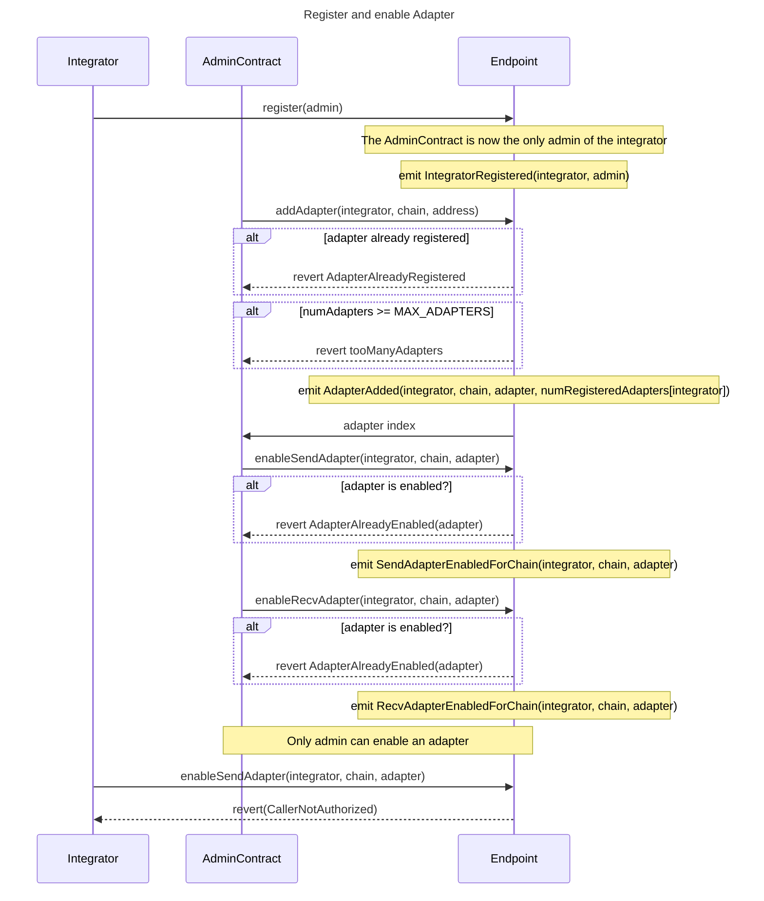

# EVM Documentation

## Design

An Integrator is the on-chain contract which will call `sendMessage` on the Endpoint. From the Endpoint’s perspective, the Integrator is the `msg.sender` of `sendMessage`. Before an Integrator is able to send their first message, they MUST `register` with the Endpoint in order to set their admin, and that admin then MUST subsequently register at least one Adapter and enable it for sending on at least one chain. The Endpoint MUST enforce that admin functions specify the Integrator address as a parameter and revert when `msg.sender` is NOT the provided Integrator’s admin.

### Contract Administration:

#### Registering an admin contract:



#### Transferring admin:


### EVM State Management Notes

**Sending** to the enabled send Adapters for a chain requires storing or computing a list of the enabled adapters. In all cases, it is most efficient to store a pre-computed “enabled” list of addresses and iterate over them. This is due to all of the enabled addresses needing to be used and the sparse nature of the bitmap (which requires the same storage read anyway after finding an enabled bit).

**Attesting** to the Endpoint by one of the enabled Adapters requires a reverse lookup of the Adapter address to an index of that address in the Integrator’s list of Adapters. In order to support storing the zero index, a boolean field, always set to true, will need to be added. Then that index can be quickly checked against the enabled receiving Adapters bitmap for that chain.

**Receiving** by the Integrator to the Endpoint should compute the digest, revert if the digest has been executed, set executed to true, and return the attestedAdapters (and potentially the perIntegratorPerChainRecvAdapters bitmap)

**Adding an Adapter** should check if the Adapter address has already been initialized (via perIntegratorAdapterInfos and if not, push it on the perIntegratorAdapters and set the initialized and index in perIntegratorAdapterInfos.

**Enabling an Adapter for Sending** should ensure the perIntegratorAdapterInfos is initialized, loop through perIntegratorEnabledSendAdapters ensuring that the Adapter is not already enabled, and then push the address to perIntegratorEnabledSendAdapters. This is more efficient than also utilizing a bitmap for adding the first through third item. Given that it becomes cost prohibitive to send and receive via more protocols (due to paying upfront for relaying costs) and these are infrequent setup costs, the simple array loop should be used, as it is more efficient in the most common use case.

**Enabling an Adapter for Receiving** should similarly ensure the `perIntegratorAdapterInfos` is `initialized`, check that the corresponding bit is not already enabled in `perIntegratorPerChainRecvAdapters` and set the bit.

**Disabling an Adapter for Sending** should loop through `perIntegratorEnabledSendAdapters` to find the matching index, swap the last item for that item and `pop` the last item. This is a [standard Solidity optimization](https://solidity-by-example.org/array/).

**Disabling an Adapter for Receiving** should similarly ensure the `perIntegratorAdapterInfos` is `initialized`, check that the corresponding bit is not already disabled in `perIntegratorPerChainRecvAdapters` and disable the bit.

The above necessitates the following storage:

```solidity
// Integrator => an array of Adapters, max length 128
mapping(address => address[]) perIntegratorAdapters;

struct AdapterInfo {
    bool registered; // this is needed so that a zero index can be used
    uint8 index;     // index in perIntegratorAdapters
}

// Integrator (message recipient) => Adapter address => AdapterInfo
// Used by Attesting, Enabling a Send or Receive Adapter
mapping(address => mapping(address => AdapterInfo)) perIntegratorAdapterInfos

// Integrator (message sender) => chainId => enabled Adapters
// Used by Sending
mapping(address => mapping(uint16 => address[])) perIntegratorEnabledSendAdapters

// Integrator (message recipient) => chainId => bitmap corresponding to perIntegratorAdapters
// Used by Receiving
mapping(address => mapping(uint16 => uint128)) perIntegratorPerChainRecvAdapters;

struct AttestationInfo {
  bool executed;                // replay protection
  uint128 attestedAdapters; // bitmap corresponding to perIntegratorAdapters
}

// Integrator (message recipient) => message digest -> attestation info
mapping(address => mapping(bytes32 => AttestationInfo)) perIntegratorAttestations;

struct IntegratorConfig {
  bool isInitialized;
  address admin;
  address pending_admin;
}

// Integrator address => configuration information
// Used by Endpoint to maintain admin information
mapping(address => IntegratorConfig) integratorConfigs
```

## Deploying the Endpoint Contract

The contract can be deployed using the following command.

```shell
evm$ RPC_URL= MNEMONIC= OUR_CHAIN_ID= EVM_CHAIN_ID= ./sh/deployEndpoint.sh
```

Note that the deploy script uses `create2` to generate a deterministic contract address.

If you need to generate flattened source to be used for contract verification, you can use the following command. The results will be in `evm/flattened`.

```shell
evm$ ./sh/flatten.sh
```

To verify the Endpoint contract, do something like this:

```shell
evm$ forge verify-contract --etherscan-api-key $ETHERSCAN_KEY --verifier etherscan --chain sepolia --watch --constructor-args $(cast abi-encode "constructor(uint16)" 10002)  0xB3375116c00873D3ED5781edFE304aC9cC75eA56 ./src/Endpoint.sol:Endpoint
```

## Development

### Foundry

**Foundry is a blazing fast, portable and modular toolkit for Ethereum application development written in Rust.**

Foundry consists of:

- **Forge**: Ethereum testing framework (like Truffle, Hardhat and DappTools).
- **Cast**: Swiss army knife for interacting with EVM smart contracts, sending transactions and getting chain data.
- **Anvil**: Local Ethereum node, akin to Ganache, Hardhat Network.
- **Chisel**: Fast, utilitarian, and verbose solidity REPL.

### Documentation

https://book.getfoundry.sh/

### Usage

#### Build

```shell
$ forge build
```

#### Test

```shell
$ forge test
```

#### Format

```shell
$ forge fmt
```

#### Gas Snapshots

```shell
$ forge snapshot
```

#### Anvil

```shell
$ anvil
```

#### Deploy

```shell
$ forge script script/Counter.s.sol:CounterScript --rpc-url <your_rpc_url> --private-key <your_private_key>
```

#### Cast

```shell
$ cast <subcommand>
```

#### Help

```shell
$ forge --help
$ anvil --help
$ cast --help
```
