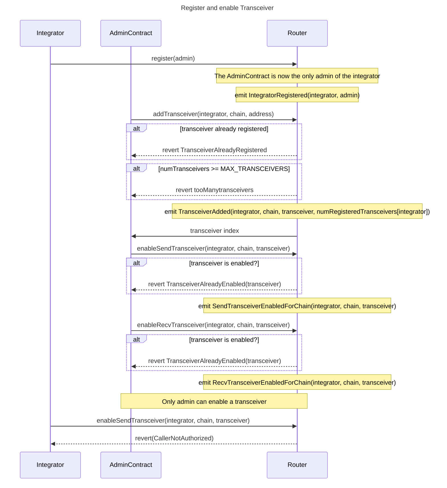
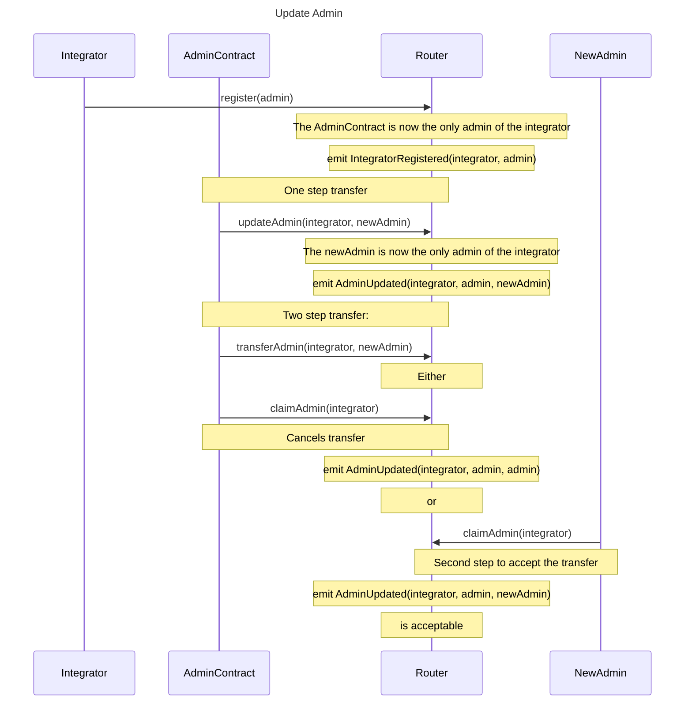

# EVM Documentation

## Design

An Integrator is the on-chain contract which will call sendMessage on the Router. From the Router’s perspective, the Integrator is the msg.sender of sendMessage. Before an Integrator is able to send their first message, they MUST register with the Router in order to set their admin, and that admin then MUST subsequently register at least one Transceiver and enable it for sending on at least one chain. The Router MUST enforce that admin functions specify the Integrator address as a parameter and revert when msg.sender is NOT the provided Integrator’s admin.

### Contract Administration:

#### Registering an admin contract:



#### Transferring admin:



### Message Flow:

The following outline describes the message flow related functions:

```solidity
/// @notice Send a message to another chain.
/// @param dstChain The Wormhole chain ID of the recipient.
/// @param dstAddr The universal address of the peer on the recipient chain.
/// @param refundAddress The source chain refund address passed to the Transceiver.
/// @param payloadHash keccak256 of a message to be sent to the recipient chain.
/// @return uint64 The sequence number of the message.
function sendMessage(
  uint16 dstChain,
  UniversalAddress dstAddr,
  address refundAddress,
  bytes32 payloadHash
) external payable returns (uint64) {
	// get the next sequence number for msg.sender
	// get the enabled send transceivers for [msg.sender][dstChain]
	// for each enabled transceiver
	//   quote the delivery price
	//     see https://github.com/wormhole-foundation/example-native-token-transfers/blob/68a7ca4132c74e838ac23e54752e8c0bc02bb4a2/evm/src/NttManager/ManagerBase.sol#L113
	//   call sendMessage
}

/// @notice Called by a Transceiver contract to attest to a message.
/// @param srcChain The Wormhole chain ID of the sender.
/// @param srcAddr The universal address of the peer on the sending chain.
/// @param sequence The sequence number of the message (per integrator).
/// @param dstChain The Wormhole chain ID of the destination.
/// @param dstAddr The destination address of the message.
/// @param payloadHash The keccak256 of payload from the integrator.
function attestMessage(
  uint16 srcChain,
  UniversalAddress srcAddr,
  uint64 sequence,
  uint16 dstChain,
  UniversalAddress dstAddr,
  bytes32 payloadHash
) external {
	// sanity check that destinationChainId is this chain
	// get enabled recv transceivers for [dstAddr][srcChain]
	// check that msg.sender is one of those transceivers
	// compute the message digest
	// do not revert if already attested or executed
	// set the bit in perIntegratorAttestations[dstAddr][digest] corresponding to msg.sender
}

/// @notice Receive a message and mark it executed.
/// @param srcChain The Wormhole chain ID of the sender.
/// @param srcAddr The universal address of the peer on the sending chain.
/// @param sequence The sequence number of the message (per integrator).
/// @param dstChain The Wormhole chain ID of the destination.
/// @param dstAddr The destination address of the message.
/// @param payloadHash The keccak256 of payload from the integrator.
/// @return (uint128, uint128) The enabled bitmap, and the attested bitmap, respectively.
function recvMessage(
  uint16 srcChain,
  UniversalAddress srcAddr,
  uint64 sequence,
  uint16 dstChain,
  UniversalAddress dstAddr,
  bytes32 payloadHash
) external returns (uint128 enabledBitmap, uint128 attestedBitmap) {
	// sanity check that dstChain is this chain
	// sanity check that msg.sender is integrator
	// compute the message digest
	// revert if not in perIntegratorAttestations map
	// revert if already executed
	// set the executed flag in perIntegratorAttestations[dstAddr][digest]
}
```

The Router MUST emit events for every admin function, message send, message attestation, and message received. The message events MUST share an identifier and include enough information to track messages across the flow, starting from any event.

### EVM State Management Notes

**Sending** to the enabled send Transceivers for a chain requires storing or computing a list of the enabled transceivers. In all cases, it is most efficient to store a pre-computed “enabled” list of addresses and iterate over them. This is due to all of the enabled addresses needing to be used and the sparse nature of the bitmap (which requires the same storage read anyway after finding an enabled bit).

**Attesting** to the Router by one of the enabled Transceivers requires a reverse lookup of the Transceiver address to an index of that address in the Integrator’s list of Transceivers. In order to support storing the zero index, a boolean field, always set to true, will need to be added. Then that index can be quickly checked against the enabled receiving Transceivers bitmap for that chain.

**Receiving** by the Integrator to the Router should compute the digest, revert if the digest has been executed, set executed to true, and return the attestedTransceivers (and potentially the perIntegratorPerChainRecvTransceivers bitmap)

**Adding a Transceiver** should check if the Transceiver address has already been initialized (via perIntegratorTransceiverInfos and if not, push it on the perIntegratorTransceivers and set the initialized and index in perIntegratorTransceiverInfos.

**Enabling a Transceiver for Sending** should ensure the perIntegratorTransceiverInfos is initialized, loop through perIntegratorEnabledSendTransceivers ensuring that the Transceiver is not already enabled, and then push the address to perIntegratorEnabledSendTransceivers. This is more efficient than also utilizing a bitmap for adding the first through third item. Given that it becomes cost prohibitive to send and receive via more protocols (due to paying upfront for relaying costs) and these are infrequent setup costs, the simple array loop should be used, as it is more efficient in the most common use case.

**Enabling a Transceiver for Receiving** should similarly ensure the `perIntegratorTransceiverInfos` is `initialized`, check that the corresponding bit is not already enabled in `perIntegratorPerChainRecvTransceivers` and set the bit.

**Disabling a Transceiver for Sending** should loop through `perIntegratorEnabledSendTransceivers` to find the matching index, swap the last item for that item and `pop` the last item. This is a [standard Solidity optimization](https://solidity-by-example.org/array/).

**Disabling a Transceiver for Receiving** should similarly ensure the `perIntegratorTransceiverInfos` is `initialized`, check that the corresponding bit is not already disabled in `perIntegratorPerChainRecvTransceivers` and disable the bit.

The above necessitates the following storage:

```solidity
// Integrator => an array of Transceivers, max length 128
mapping(address => address[]) perIntegratorTransceivers;

struct TransceiverInfo {
    bool registered; // this is needed so that a zero index can be used
    uint8 index;     // index in perIntegratorTransceivers
}

// Integrator (message recipient) => Transceiver address => TransceiverInfo
// Used by Attesting, Enabling a Send or Receive Transceiver
mapping(address => mapping(address => TransceiverInfo)) perIntegratorTransceiverInfos

// Integrator (message sender) => chainId => enabled Transceivers
// Used by Sending
mapping(address => mapping(uint16 => address[])) perIntegratorEnabledSendTransceivers

// Integrator (message recipient) => chainId => bitmap corresponding to perIntegratorTransceivers
// Used by Receiving
mapping(address => mapping(uint16 => uint128)) perIntegratorPerChainRecvTransceivers;

struct AttestationInfo {
  bool executed;                // replay protection
  uint128 attestedTransceivers; // bitmap corresponding to perIntegratorTransceivers
}

// Integrator (message recipient) => message digest -> attestation info
mapping(address => mapping(bytes32 => AttestationInfo)) perIntegratorAttestations;
```

## Development

### Foundry

**Foundry is a blazing fast, portable and modular toolkit for Ethereum application development written in Rust.**

Foundry consists of:

- **Forge**: Ethereum testing framework (like Truffle, Hardhat and DappTools).
- **Cast**: Swiss army knife for interacting with EVM smart contracts, sending transactions and getting chain data.
- **Anvil**: Local Ethereum node, akin to Ganache, Hardhat Network.
- **Chisel**: Fast, utilitarian, and verbose solidity REPL.

### Documentation

https://book.getfoundry.sh/

### Usage

#### Build

```shell
$ forge build
```

#### Test

```shell
$ forge test
```

#### Format

```shell
$ forge fmt
```

#### Gas Snapshots

```shell
$ forge snapshot
```

#### Anvil

```shell
$ anvil
```

#### Deploy

```shell
$ forge script script/Counter.s.sol:CounterScript --rpc-url <your_rpc_url> --private-key <your_private_key>
```

#### Cast

```shell
$ cast <subcommand>
```

#### Help

```shell
$ forge --help
$ anvil --help
$ cast --help
```
