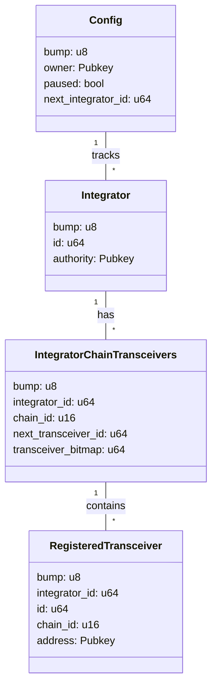

# GMP Router

## Project Structure

```mermaid
classDiagram
    class Config {
        bump: u8
        owner: Pubkey
        paused: bool
        next_integrator_id: u64
    }

    class Integrator {
        bump: u8
        id: u64
        authority: Pubkey
    }

    class IntegratorChainTransceivers {
        bump: u8
        integrator_id: u64
        chain_id: u16
        next_transceiver_id: u64
        transceiver_bitmap: u64
    }

    class RegisteredTransceiver {
        bump: u8
        integrator_id: u64
        id: u64
        chain_id: u16
        address: Pubkey
    }

    Config "1" -- "*" Integrator : tracks
    Integrator "1" -- "*" IntegratorChainTransceivers : has
    IntegratorChainTransceivers "1" -- "*" RegisteredTransceiver : contains
```
