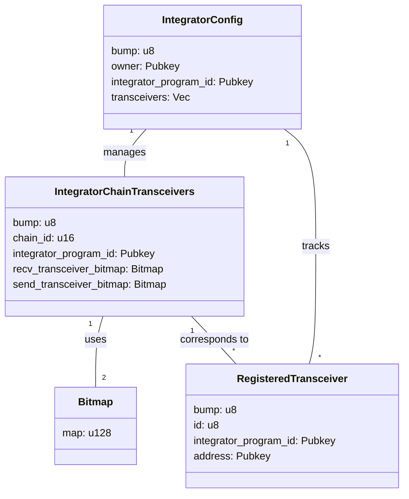

# GMP Router

## Project Structure

### Key Components

1. **IntegratorConfig**: Stores configuration specific to an Integrator.

   - **bump**: Bump seed for PDA derivation.
   - **owner**: The owner of the IntegratorConfig account.
   - **integrator_program_id**: The program ID of the Integrator.
   - **transceivers**: Vector of registered transceiver addresses (max 32).

2. **IntegratorChainTransceivers**: Manages transceivers for a specific integrator on a particular chain.

   - **bump**: Bump seed for PDA derivation.
   - **chain_id**: Identifier for the blockchain network.
   - **integrator_program_id**: The program ID of the Integrator.
   - **recv_transceiver_bitmap**: Bitmap tracking enabled receive transceivers.
   - **send_transceiver_bitmap**: Bitmap tracking enabled send transceivers.

3. **RegisteredTransceiver**: Represents a registered transceiver in the GMP Router.

   - **bump**: Bump seed for PDA derivation.
   - **id**: Unique ID of the transceiver within the integrator's context.
   - **integrator_program_id**: The program ID of the Integrator.
   - **address**: Public key of the transceiver's address.

   **Constraints**:
      - Maximum of 128 transceivers per integrator (as defined in IntegratorConfig).
      - Will return an error (MaxTransceiversReached) if this limit is exceeded.

4. **Bitmap**: Utility struct for efficient storage and manipulation of boolean flags.

   - **map**: Stores the bitmap as a `u128`.

### PDA Derivation

1. **IntegratorConfig**

   - **Seeds**: `[SEED_PREFIX, integrator_program_id]`
   - **Unique** for each integrator program.
   - **Initialization**:
     - The integrator program must sign the transaction to initialize its config.
     - The owner is set during initialization but is not required to sign.

2. **IntegratorChainTransceivers**

   - **Seeds**: `[SEED_PREFIX, integrator_program_id, chain_id]`
   - **Unique** for each integrator program and chain combination.
   - **Initialization**: Requires the owner's signature and an existing IntegratorConfig account.

3. **RegisteredTransceiver**

   - **Seeds**: `[SEED_PREFIX, integrator_program_id, transceiver_address]`
   - **Unique** for each transceiver within an integrator context.

### Instructions

1. **init_integrator_config**: Initializes the integrator configuration.
2. **initialize_integrator_chain_transceivers**: Sets up the chain transceivers for an integrator on a specific chain.
3. **register_transceiver**: Registers a new transceiver for an integrator.
4. **set_recv_transceiver**: Enables a receive transceiver for a specific chain.
5. **disable_recv_transceiver**: Disables a receive transceiver for a specific chain.
6. **set_send_transceiver**: Enables a send transceiver for a specific chain.
7. **disable_send_transceiver**: Disables a send transceiver for a specific chain.
8. **transfer_integrator_config_ownership**: Transfers ownership of the IntegratorConfig to a new owner.

### Error Handling

The program uses a custom `RouterError` enum to handle various error cases, including:

- Invalid integrator authority
- Bitmap index out of bounds
- Maximum number of transceivers reached
- Invalid transceiver ID

### Tests

1. **InitIntegratorConfig**

   - [x] Test successful initialization
   - [x] Test reinitialization (should fail with AccountAlreadyInUse error)
   - [x] Test initialization for different integrator programs

2. **InitializeIntegratorChainTransceivers**

   - [x] Test successful initialization
   - [x] Test initialization for already initialized chain (should fail)
   - [x] Test initialization for different chains
   - [x] Test initialization with invalid authority

3. **RegisterTransceiver**

   - [x] Test successful registration
   - [x] Test registration causing bitmap overflow
   - [x] Test registration with non-authority signer
   - [ ] Test registration of duplicate transceiver (not implemented yet)
   - [ ] Test registration with invalid transceiver address
     > **Note on Reinitialization:**
     > There is no need to test for reinitialization of the `IntegratorConfig` because the `next_transceiver_id` in `integrator_config` is auto-incremented. This ensures that each transceiver is uniquely identified and prevents accidental overwriting or duplication during initialization.

4. **SetTransceivers**
   - [x] Test successful setting of incoming transceivers
   - [x] Test successful setting of outgoing transceivers
   - [x] Test setting transceivers with invalid authority
   - [x] Test setting transceivers with invalid bitmap
   - [x] Test multiple updates of transceiver settings
