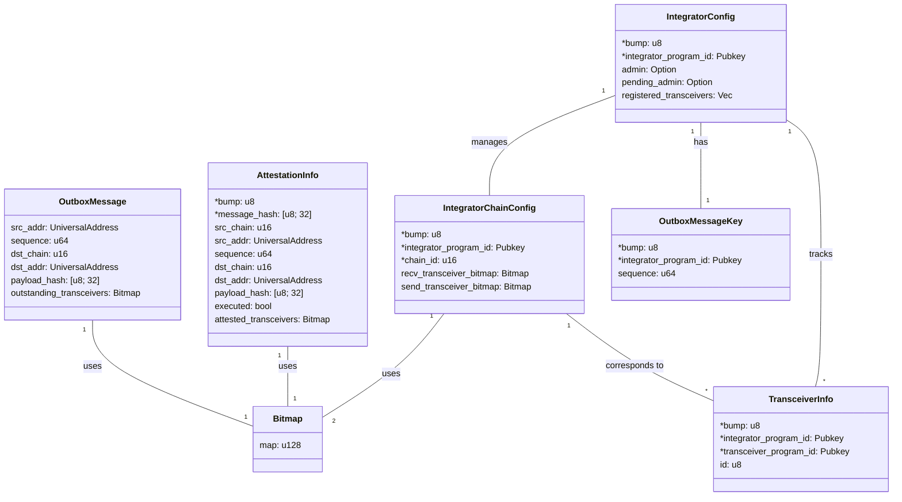
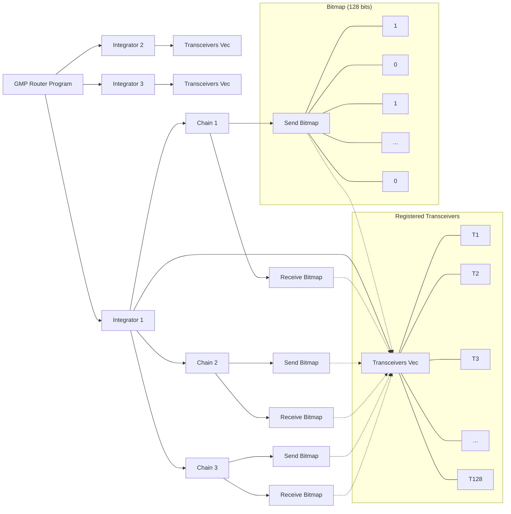

# GMP Router

## Table of Contents

1. [Project Overview](#project-overview)
2. [Architecture](#architecture)
3. [Key Components](#key-components)
4. [Instructions](#instructions)
5. [Error Handling](#error-handling)
6. [Testing](#testing)

## Architecture

> **Note:** fields marked with an asterisk (\*) in the class diagrams are used as seeds for Program Derived Address (PDA) derivation.

### Program Structure

This diagram illustrates the overall structure of the GMP Router program:

- The program manages multiple integrators.
- Each integrator has a vector of up to 128 transceivers.
- For each integrator, there are multiple chains.
- Each chain has a send bitmap and a receive bitmap.
- The bitmaps correspond to the transceiver vector, indicating which transceivers are enabled for sending or receiving on that specific chain.

## Key Components

### IntegratorConfig

Manages the configuration for a specific integrator.

- **bump**: Bump seed for PDA derivation
- **integrator_program_id**: The program ID associated with this integrator
- **admin**: The current admin of the IntegratorConfig account (None if admin is discarded)
- **pending_admin**: The pending admin of the IntegratorConfig account (if a transfer is in progress)
- **registered_transceivers**: Vector of registered transceiver addresses

**PDA Derivation**:

- Seeds: `[SEED_PREFIX, integrator_program_id]`
- Unique for each integrator program
- Initialization: Requires integrator_program's PDA seeded by "router_integrator"

**Constraints**:

- Maximum of 128 transceivers per integrator

### IntegratorChainConfig

Manages transceivers enabled and config for a specific integrator on a particular chain.

- **bump**: Bump seed for PDA derivation
- **integrator_program_id**: The program ID of the Integrator
- **chain_id**: Identifier for the blockchain network
- **send_transceiver_bitmap**: Bitmap tracking enabled send transceivers
- **recv_transceiver_bitmap**: Bitmap tracking enabled receive transceivers

**PDA Derivation**:

- Seeds: `[SEED_PREFIX, integrator_program_id, chain_id]`
- Unique for each integrator program and chain combination
- Initialization: Requires admin's signature and existing IntegratorConfig account

### TransceiverInfo

Represents a registered transceiver in the GMP Router.

- **bump**: Bump seed for PDA derivation
- **integrator_program_id**: The program ID of the Integrator
- **transceiver_program_id**: Public key of the transceiver's address
- **index**: Unique index of the transceiver that corresponds to its position in the registered_transceivers in IntegratorConfig account

**PDA Derivation**:

- Seeds: `[SEED_PREFIX, integrator_program_id, transceiver_program_id]`
- Unique for each transceiver within an integrator context

### Bitmap

Utility struct for efficient storage and manipulation of boolean flags.

- **map**: Stores the bitmap as a `u128`

### AttestationInfo

Stores information about message attestations.

- **bump**: Bump seed for PDA derivation
- **message_hash**: Hash of the message (used as a seed for PDA derivation)
- **src_chain**: Source chain ID
- **src_addr**: Source address
- **sequence**: Sequence number
- **dst_chain**: Destination chain ID
- **dst_addr**: Destination address
- **payload_hash**: Hash of the payload
- **executed**: Flag indicating if the message has been executed
- **attested_transceivers**: Bitmap of transceivers that have attested to the message

**PDA Derivation**:

- Seeds: `[SEED_PREFIX, message_hash]`

### OutboxMessage

Represents an outgoing message in the outbox.

- **src_addr**: The sending integrator's address
- **sequence**: The sequence number of the message
- **dst_chain**: The destination chain's Wormhole Chain ID
- **dst_addr**: The destination address
- **payload_hash**: The hash of the message payload
- **outstanding_transceivers**: Bitmap of send-enabled transceivers that have not picked up the message

### OutboxMessageKey

Tracks the sequence number for an integrator program.

- **bump**: Bump seed for PDA derivation
- **integrator_program_id**: The program ID of the integrator (used as a seed for PDA derivation)
- **sequence**: The current sequence number for this integrator

**PDA Derivation**:

- Seeds: `[SEED_PREFIX, integrator_program_id]`

## Instructions

1. `register`: Registers an integrator and initializes their configuration
2. `add_transceiver`: Registers a new transceiver for an integrator
3. `enable_recv_transceiver`: Sets a transceiver as a receive transceiver for a specific chain
4. `enable_send_transceiver`: Sets a transceiver as a send transceiver for a specific chain
5. `disable_recv_transceiver`: Disables a receive transceiver for a specific chain
6. `disable_send_transceiver`: Disables a send transceiver for a specific chain
7. `update_admin`: A one-step transfer of admin rights for the IntegratorConfig to a new admin
8. `transfer_admin`: Initiates the transfer of admin rights for the IntegratorConfig to a new admin
9. `claim_admin`: Completes the transfer of admin rights, allowing the new admin to claim authority
10. `discard_admin`: Sets IntegratorConfig as immutable to emulate discarding admin on EVM. Action is irreversible
11. `pick_up_message`: Allows a transceiver to pick up a message from the outbox, updating the outstanding transceivers bitmap
12. `recv_message`: Receives a message that has been attested to, marking it as executed and returning enabled receive transceivers and attestations
13. `send_message`: Creates a new outbox message for the specified destination chain and address, initializing it with provided information
14. `attest_message`: Marks an attestation by an outstanding_transceiver to be true for a message.
15. `exec_message`: Bypasses attestation check and marks message as executed for replay protection.

## Error Handling

The program uses a custom `RouterError` enum to handle various error cases, including:

- `CallerNotAuthorized`: The caller is not authorized to perform the action
- `BitmapIndexOutOfBounds`: Bitmap index is out of bounds
- `MaxTransceiversReached`: Maximum number of transceivers reached
- `TransceiverAlreadyEnabled`: Transceiver was already enabled
- `TransceiverAlreadyDisabled`: Transceiver was already disabled
- `AdminTransferInProgress`: An admin transfer is in progress
- `NoAdminTransferInProgress`: No admin transfer is currently in progress
- `InvalidChainId`: The provided chain ID is invalid
- `TransceiverNotEnabled`: No transceivers are enabled for the operation
- `DuplicateMessageAttestation`: An attempt was made to attest to a message more than once
- `MessageAlreadyPickedUp`: The message has already been picked up
- `AlreadyExecuted`: The message has already been executed
- `UnknownMessageAttestation`: The message attestation is unknown or invalid

## Testing

| Instruction                                                                                              | Requirements                                                                                                                                                                                                                                                                                                                                                                                                      | Implemented Tests                                                                                                                                                                                                                                                                                                                                                                                                                                             |
| -------------------------------------------------------------------------------------------------------- | ----------------------------------------------------------------------------------------------------------------------------------------------------------------------------------------------------------------------------------------------------------------------------------------------------------------------------------------------------------------------------------------------------------------- | ------------------------------------------------------------------------------------------------------------------------------------------------------------------------------------------------------------------------------------------------------------------------------------------------------------------------------------------------------------------------------------------------------------------------------------------------------------- |
| register(initialAdmin)                                                                                   | - Check caller not already registered - Initialize registration and set initial admin                                                                                                                                                                                                                                                                                                                          | [x] Successful initialization of IntegratorConfig [x] Reinitialization (fails with AccountAlreadyInUse error)                                                                                                                                                                                                                                                                                                                                              |
| updateAdmin(integratorAddr, newAdmin)                                                                    | - Check caller is current admin - Check no pending transfer - Check IntegratorConfig is not immutable - Immediately set new admin                                                                                                                                                                                                                                                                        | [x] Successful admin update [x] Update with non-authority signer (fails with CallerNotAuthorized) [x] Update to the same admin address (succeeds) [x] Update when admin transfer in progress (fails with AdminTransferInProgress) [x] Update when IntegratorConfig is immutable (fails with CallerNotAuthorized)                                                                                                                                  |
| transferAdmin(integratorAddr, newAdmin)                                                                  | - Check caller is current admin - Check no pending transfer - Check IntegratorConfig is not immutable - Set pending admin to the new admin                                                                                                                                                                                                                                                               | [x] Successful initiation of admin transfer [x] Transfer when transfer already in progress (fails with AdminTransferInProgress) [x] Transfer by non-authority signer (fails with CallerNotAuthorized) [x] Transfer when IntegratorConfig is immutable (fails with CallerNotAuthorized)                                                                                                                                                               |
| claimAdmin(integratorAddr)                                                                               | - Check caller is current or pending admin - Check admin transfer is pending - Complete/cancel transfer                                                                                                                                                                                                                                                                                                     | [x] Successful claiming of admin rights by new admin [x] Successful claiming of admin rights by current admin (cancels transfer) [x] Claim when there is no pending admin (fails with CallerNotAuthorized) [x] Claim by unauthorized user (fails with CallerNotAuthorized)                                                                                                                                                                           |
| discardAdmin(integratorAddr)                                                                             | - Check caller is current admin - Check no pending transfer - Check IntegratorConfig is not immutable - Clear current admin (make config immutable)                                                                                                                                                                                                                                                      | [x] Successful discarding of admin [x] Discard when already discarded (fails with CallerNotAuthorized) [x] Discard when transfer in progress (fails with AdminTransferInProgress)                                                                                                                                                                                                                                                                       |
| addTransceiver(integratorAddr, transceiverAddr)                                                          | - Check caller is current admin - Check no pending transfer - Check IntegratorConfig is not immutable - Check transceiver not already in array - Check array won't surpass 128 entries - Append transceiver to array                                                                                                                                                                               | [x] Successful addition of a transceiver [x] Addition of multiple transceivers [x] Addition with non-authority signer (fails with CallerNotAuthorized) [x] Addition when admin transfer in progress (fails with AdminTransferInProgress) [x] Addition when IntegratorConfig is immutable (fails with CallerNotAuthorized) [x] Register max transceivers (fails when exceeding) [x] Reinitialization of existing transceiver (fails)         |
| enableSendTransceiver(integratorAddr, chain, transceiverAddr)                                            | - Check caller is current admin - Check no pending transfer - Check IntegratorConfig is not immutable - Check transceiver in array - Check transceiver currently disabled for sending - Enable transceiver for sending                                                                                                                                                                             | [x] Successful enabling of send transceiver [x] Enabling with invalid admin (fails with CallerNotAuthorized) [x] Enabling with invalid transceiver ID (fails with AccountNotInitialized) [x] Enabling when admin transfer in progress (fails with AdminTransferInProgress) [x] Enabling when IntegratorConfig is immutable (fails with CallerNotAuthorized) [x] Enabling already enabled transceiver (fails with TransceiverAlreadyEnabled)    |
| disableSendTransceiver(integratorAddr, chain, transceiverAddr)                                           | - Check caller is current admin - Check no pending transfer - Check IntegratorConfig is not immutable - Check transceiver in array - Check transceiver currently enabled for sending - Disable transceiver for sending                                                                                                                                                                             | [x] Successful disabling of send transceiver [x] Disabling with invalid admin (fails with CallerNotAuthorized) [x] Disabling when admin transfer in progress (fails with AdminTransferInProgress) [x] Disabling when IntegratorConfig is immutable (fails with CallerNotAuthorized) [x] Disabling already disabled transceiver (fails with TransceiverAlreadyDisabled)                                                                            |
| enableRecvTransceiver(integratorAddr, chain, transceiverAddr)                                            | - Check caller is current admin - Check no pending transfer - Check IntegratorConfig is not immutable - Check transceiver in array - Check transceiver currently disabled for receiving - Enable transceiver for receiving                                                                                                                                                                         | [x] Successful enabling of receive transceiver [x] Enabling with invalid admin (fails with CallerNotAuthorized) [x] Enabling with invalid transceiver ID (fails with AccountNotInitialized) [x] Enabling when admin transfer in progress (fails with AdminTransferInProgress) [x] Enabling when IntegratorConfig is immutable (fails with CallerNotAuthorized) [x] Enabling already enabled transceiver (fails with TransceiverAlreadyEnabled) |
| disableRecvTransceiver(integratorAddr, chain, transceiverAddr)                                           | - Check caller is current admin - Check no pending transfer - Check IntegratorConfig is not immutable - Check transceiver in array - Check transceiver currently enabled for receiving - Disable transceiver for receiving                                                                                                                                                                         | [x] Successful disabling of receive transceiver [x] Disabling with invalid admin (fails with CallerNotAuthorized) [x] Disabling when admin transfer in progress (fails with AdminTransferInProgress) [x] Disabling when IntegratorConfig is immutable (fails with CallerNotAuthorized) [x] Disabling already disabled transceiver (fails with TransceiverAlreadyDisabled)                                                                         |
| pickUpMessage(outboxMsg)                                                                                 | - Check Transceiver is an enabled send Transceiver for the Integrator (srcAddr) and destination chain (dstChain) - Check Transceiver has NOT already picked up the message - Mark Transceiver as having picked up the message - Closes outbox message account upon last enabled sending Transceiver's pickup                                                                                             | [x] Successful message pickup [ ] Pickup with disabled Transceiver (fails with MessageAlready) [x] Pickup of already picked up message (fails) [x] Pickup by last enabled Transceiver (closes account) [x] Pickup attempt after account closed(fails)                                                                                                                                                                                             |
| sendMessage(dstChain, dstAddr, payloadHash) → sequence                                                   | - MUST have at least one enabled **send** Transceiver for `dstChain` - Increments the Integrator's sequence and performs the steps to send the message or prepare it for sending, as applicable - If Transceivers must pull outgoing messages in the given implementation (via `pickUpMessage`), the Router MUST set the current enabled Send Transceivers as the Outstanding Transceivers for that message | [x] Successful message sending [x] Correct outbox message creation (src_addr, sequence, dst_chain, dst_addr, payload_hash, outstanding_transceivers) [x] Sending with no enabled transceivers (fails with AccountNotInitialized) [x] Sending to unregistered chain (fails with AccountNotInitialized) [x] Correct updating of OutboxMessageKey sequence                                                                                           |
| attestMessage(srcChain, srcAddr, sequence, dstChain, dstAddr, payloadHash)                               | - MUST check that the Transceiver is an enabled **receive** Transceiver for the Integrator (`dstAddr`) and **source** chain (`srcChain`). - MUST check that the Transceiver has NOT already attested. - MUST allow a Transceiver to attest after message execution. - Calculates the message hash and marks the Transceiver as having attested to the message.                                           | [x] Successful message attestation [x] Correct attestation info creation (src_chain, src_addr, sequence, dst_chain, dst_addr, payload_hash) [ ] Attestation with disabled transceiver (fails with TransceiverNotEnabled) [x] Duplicate attestation (fails with DuplicateMessageAttestation) [x] Attestation after message execution                                                                                                               |
| execMessage(srcChain, srcAddr, sequence, dstChain, dstAddr, payloadHash)                                 | - MUST revert if already executed. - MUST NOT require any Transceivers to have attested. - Marks the message as executed.                                                                                                                                                                                                                                                                                   | [x] Successful message execution [x] Correct attestation info creation (src_chain, src_addr, sequence, dst_chain, dst_addr, payload_hash) [x] Execution of already executed message (fails with AlreadyExecuted) [x] Execution before any attestations                                                                                                                                                                                               |
| recvMessage(srcChain, srcAddr, sequence, dstChain, dstAddr, payloadHash) → enabledBitmap, attestedBitmap | - MUST check that at least one Transceiver has attested. - MUST revert if already executed. - Marks the message as executed and returns the enabled receive Transceivers for that chain along with the attestations. - NOTE: for efficiency, this combines `getMessageStatus` and `execMessage` into one call and is expected to be the primary way that Integrators receive messages.                   | [x] Successful message receive [x] Receiving already executed message (fails with AlreadyExecuted) [x] Receiving message without prior attestation (fails with AccountNotInitialized - error code 3012) [ ] Correct return of enabled and attested bitmaps                                                                                                                                                                                           |
