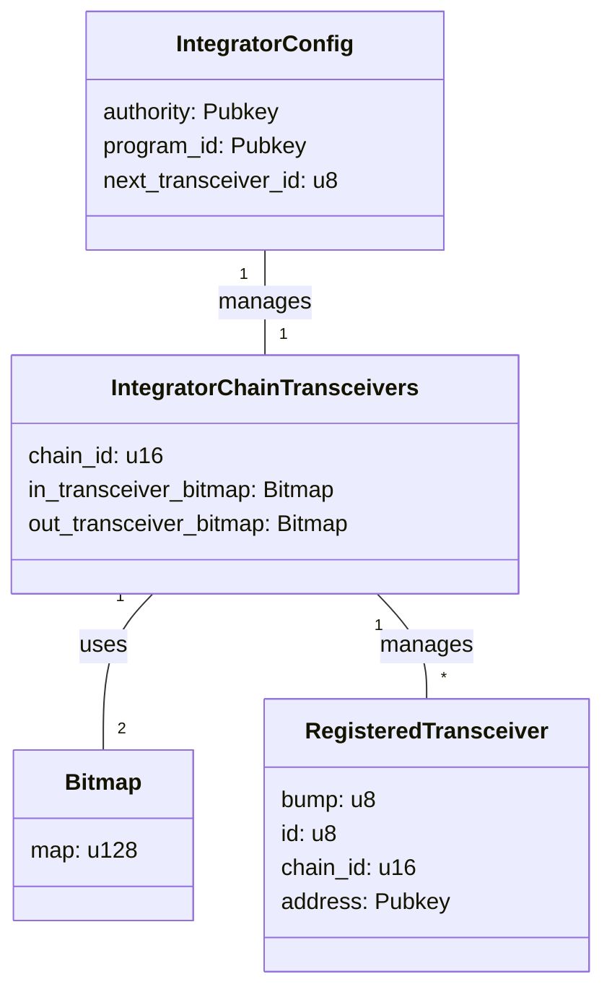

# GMP Router

## Project Structure

### Key Components

1. **IntegratorConfig**: Stores configuration specific to an Integrator.

   - **authority**: The authority of the Integrator config.
   - **program_id**: The program ID of the Integrator.
   - **next_transceiver_id**: Counter to track the next transceiver ID.

2. **IntegratorChainTransceivers**: Manages transceivers for a specific integrator on a particular chain.

   - **chain_id**: Identifier for the blockchain network.
   - **in_transceiver_bitmap**: Bitmap tracking enabled incoming transceivers by their IDs, corresponding to the transceiver IDs managed by `IntegratorConfig`.
   - **out_transceiver_bitmap**: Bitmap tracking enabled outgoing transceivers by their IDs, corresponding to the transceiver IDs managed by `IntegratorConfig`.

3. **RegisteredTransceiver**: Represents a registered transceiver in the GMP Router.

   - **bump**: Bump seed for PDA derivation.
   - **id**: Unique ID of the transceiver.
   - **chain_id**: Associated chain ID.
   - **address**: Address of the transceiver.

4. **Bitmap**: Utility struct for efficient storage and manipulation of boolean flags.

   - **map**: Stores the bitmap as a `u128`.

### PDA Derivation

1. **IntegratorConfig**

   - **Seeds**: `[SEED_PREFIX, integrator_pubkey]`
   - **Unique** for each integrator.

2. **IntegratorChainTransceivers**

   - **Seeds**: `[SEED_PREFIX, integrator_config_pubkey, chain_id]`
   - **Unique** for each integrator and chain combination.

3. **RegisteredTransceiver**

   - **Seeds**: `[SEED_PREFIX, integrator_program_id, transceiver_id]`
   - **Unique** for each transceiver within an integrator context.

### Relationships

- Each **IntegratorConfig** manages multiple **IntegratorChainTransceivers**.
- Each **IntegratorChainTransceivers** uses two **Bitmap** instances to track incoming and outgoing transceiver statuses based on their IDs.
- Each **IntegratorChainTransceivers** manages multiple **RegisteredTransceivers**.
- **RegisteredTransceivers** are associated with a specific integrator and chain, tracked by their unique IDs.

For detailed documentation on each component and its methods, please refer to the source files.

### Tests

1. **InitIntegratorChainTransceivers**

   - [x] Test init_integrator_chain_transceivers success
   - [x] Test init_integrator_chain_transceivers already initialized
   - [x] Test init_integrator_chain_transceivers for different chains
   - [ ] Test init_integrator_chain_transceivers with invalid chain ID
   - [ ] Test init_integrator_chain_transceivers with invalid owner

2. **RegisterTransceiver**

   - [x] Test register_transceiver success
   - [x] Test register_transceiver bitmap overflow
   - [x] Test register_transceiver with non-authority
   - [ ] Test registration of outgoing transceivers
   - [ ] Test attempt to register a duplicate transceiver
   - [ ] Test registration with invalid chain ID
   - [ ] Test registration with invalid transceiver address

3. **TransferIntegratorChainTransceiversOwnership**
   - [x] Test successful ownership transfer
   - [x] Test attempt to transfer ownership with non-owner account
   - [ ] Test attempt to transfer ownership to the same owner
   - [ ] Test attempt to transfer ownership to a zero address
   - [ ] Test registration of transceivers after ownership transfer
