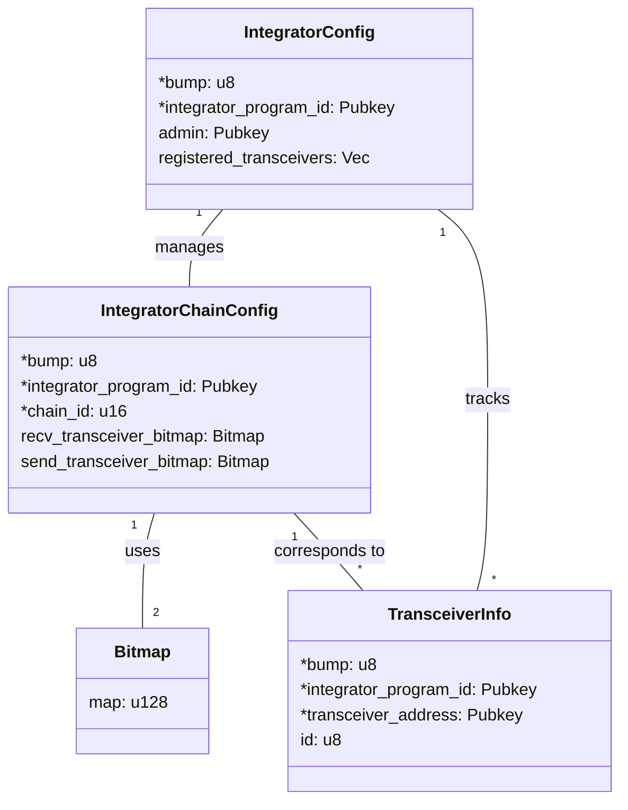
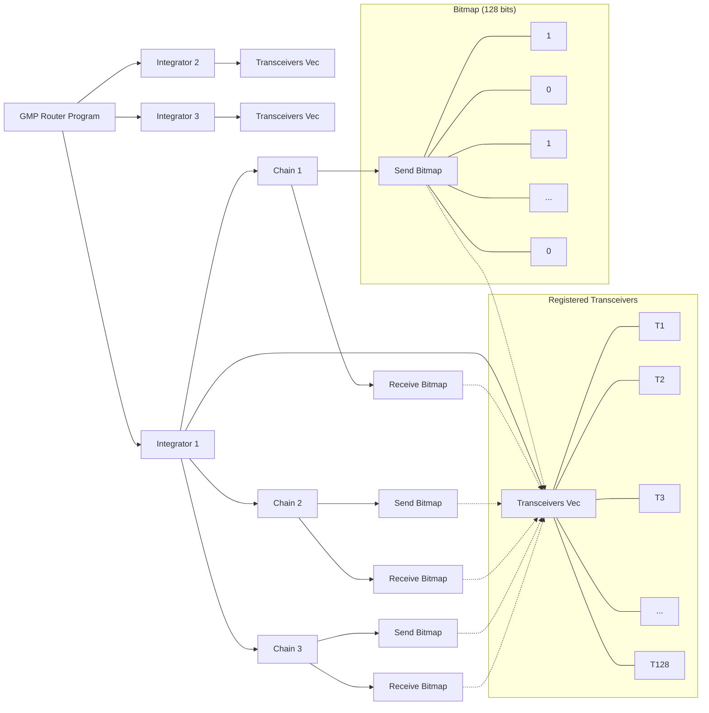

# GMP Router

## Table of Contents

1. [Project Overview](#project-overview)
2. [Architecture](#architecture)
3. [Key Components](#key-components)
4. [Instructions](#instructions)
5. [Error Handling](#error-handling)
6. [Testing](#testing)

## Architecture

> **Note:** fields marked with an asterisk (\*) in the class diagrams are used as seeds for Program Derived Address (PDA) derivation.

### Program Structure

This diagram illustrates the overall structure of the GMP Router program:

- The program manages multiple integrators.
- Each integrator has a vector of up to 128 transceivers.
- For each integrator, there are multiple chains.
- Each chain has a send bitmap and a receive bitmap.
- The bitmaps correspond to the transceiver vector, indicating which transceivers are enabled for sending or receiving on that specific chain.

## Key Components

### IntegratorChainConfig

Manages transceivers enabled and config for a specific integrator on a particular chain.

- **bump**: Bump seed for PDA derivation
- **chain_id**: Identifier for the blockchain network
- **integrator_program_id**: The program ID of the Integrator
- **recv_transceiver_bitmap**: Bitmap tracking enabled receive transceivers
- **send_transceiver_bitmap**: Bitmap tracking enabled send transceivers

**PDA Derivation**:

- Seeds: `[SEED_PREFIX, integrator_program_id, chain_id]`
- Unique for each integrator program and chain combination
- Initialization: Requires admin's signature and existing IntegratorConfig account

### IntegratorChainConfig

Manages transceivers enabled and config for a specific integrator on a particular chain.

- **bump**: Bump seed for PDA derivation
- **chain_id**: Identifier for the blockchain network
- **integrator_program_id**: The program ID of the Integrator
- **recv_transceiver_bitmap**: Bitmap tracking enabled receive transceivers
- **send_transceiver_bitmap**: Bitmap tracking enabled send transceivers

**PDA Derivation**:

- Seeds: `[SEED_PREFIX, integrator_program_id, chain_id]`
- Unique for each integrator program and chain combination
- Initialization: Requires admin's signature and existing IntegratorConfig account

### TransceiverInfo

Represents a registered transceiver in the GMP Router.

- **bump**: Bump seed for PDA derivation
- **id**: Unique ID of the transceiver within the integrator's context
- **integrator_program_id**: The program ID of the Integrator
- **address**: Public key of the transceiver's address

**PDA Derivation**:

- Seeds: `[SEED_PREFIX, integrator_program_id, transceiver_address]`
- Unique for each transceiver within an integrator context

**Constraints**:

- Maximum of 128 transceivers per integrator
- Will return an error (MaxTransceiversReached) if this limit is exceeded

### Bitmap

Utility struct for efficient storage and manipulation of boolean flags.

- **map**: Stores the bitmap as a `u128`

## Instructions

1. `register`: Registers an integrator and initializes their configuration
2. `register_transceiver`: Registers a new transceiver for an integrator
3. `set_recv_transceiver`: Sets a transceiver as a receive transceiver for a specific chain
4. `set_send_transceiver`: Sets a transceiver as a send transceiver for a specific chain
5. `disable_recv_transceiver`: Disables a receive transceiver for a specific chain
6. `disable_send_transceiver`: Disables a send transceiver for a specific chain
7. `update_admin`: Transfers admin of the IntegratorConfig to a new admin

## Error Handling

The program uses a custom `RouterError` enum to handle various error cases, including:

- `InvalidIntegratorAuthority`: Invalid integrator authority
- `BitmapIndexOutOfBounds`: Bitmap index is out of bounds
- `MaxTransceiversReached`: Maximum number of transceivers reached
- `TransceiverAlreadyEnabled`: Transceiver was already enabled
- `TransceiverAlreadyDisabled`: Transceiver was already disabled

## Testing

### Register

- [x] Successful initialization of IntegratorConfig
- [x] Reinitialization (fails with AccountAlreadyInUse error)

### RegisterTransceiver

- [x] Successful registration
- [x] Registration of multiple transceivers
- [x] Registration of more than 128 transceivers (fails with MaxTransceiversReached)
- [x] Registration of duplicate transceiver (fails with AccountAlreadyInUse error)
- [x] Registration with non-authority signer (fails with InvalidIntegratorAuthority error)

### SetTransceivers

- [x] Successful setting of incoming transceivers
- [x] Successful setting of outgoing transceivers
- [x] Setting transceivers with invalid authority (fails with InvalidIntegratorAuthority error)
- [x] Setting transceivers with invalid transceiver ID (fails with AccountNotInitialized error)
- [x] Multiple updates of transceiver settings
- [x] Attempt to enable already enabled transceiver (fails with TransceiverAlreadyEnabledError)

### DisableTransceivers

- [x] Successful disabling of incoming transceivers
- [x] Successful disabling of outgoing transceivers
- [x] Disabling transceivers with invalid authority (fails with InvalidIntegratorAuthority error)
- [x] Disabling transceivers with invalid transceiver ID (fails with AccountNotInitialized error)
- [x] Attempt to disable already disabled transceiver (fails with TransceiverAlreadyDisabled error)

### UpdateAdmin

> **Note:** The `update_admin` logic needs to be redone. Ignore this for now

- [x] Successful admin transfer
- [x] Transfer with invalid current admin
- [x] Transfer to the same admin
