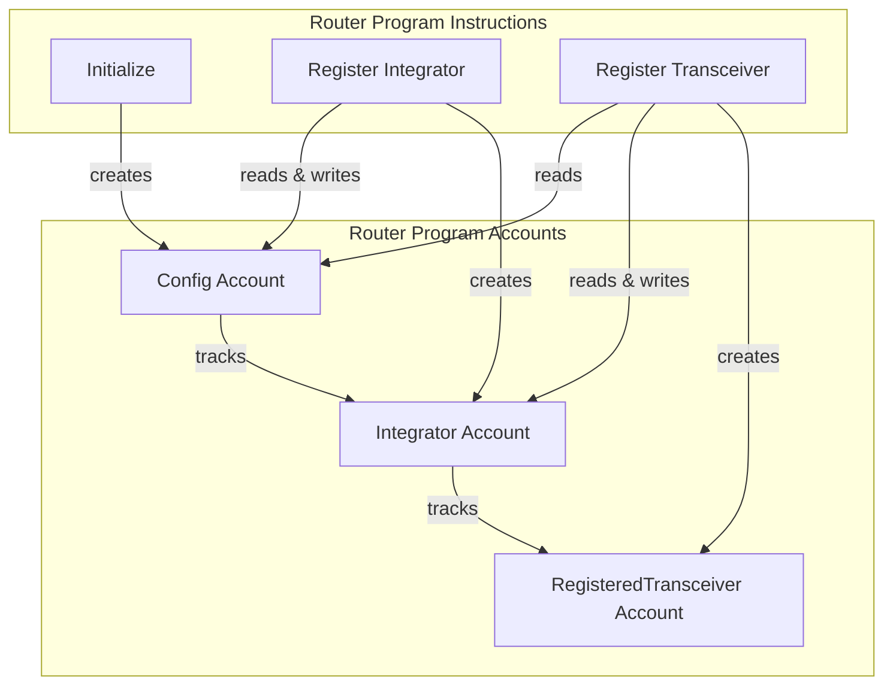

# GMP Router

## Project Structure

```mermaid
graph TD
    subgraph "Router Program Accounts"
        Config[Config Account]
        Integrator[Integrator Account]
        RegisteredTransceiver[RegisteredTransceiver Account]
    end

    subgraph "Router Program Instructions"
        Initialize[Initialize]
        RegisterIntegrator[Register Integrator]
        RegisterTransceiver[Register Transceiver]
    end

    Initialize -->|creates| Config
    RegisterIntegrator -->|reads & writes| Config
    RegisterIntegrator -->|creates| Integrator
    RegisterTransceiver -->|reads| Config
    RegisterTransceiver -->|reads & writes| Integrator
    RegisterTransceiver -->|creates| RegisteredTransceiver

    Config -->|tracks| Integrator
    Integrator -->|tracks| RegisteredTransceiver
```
