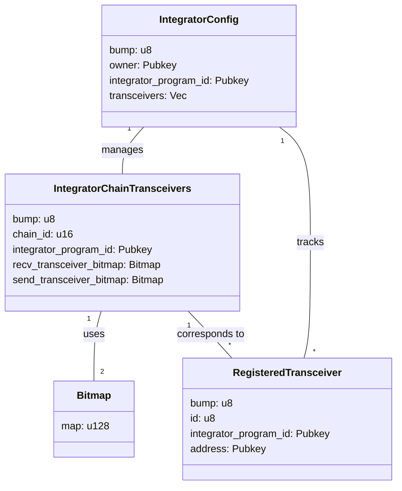

# GMP Router

## Table of Contents
1. [Project Overview](#project-overview)
2. [Architecture](#architecture)
3. [Key Components](#key-components)
4. [Instructions](#instructions)
5. [Error Handling](#error-handling)
6. [Testing](#testing)

## Architecture

## Key Components

### IntegratorConfig
Stores configuration specific to an Integrator.
- **bump**: Bump seed for PDA derivation
- **owner**: The owner of the IntegratorConfig account
- **integrator_program_id**: The program ID of the Integrator
- **transceivers**: Vector of registered transceiver addresses (max 32)

**PDA Derivation**:
- Seeds: `[SEED_PREFIX, integrator_program_id]`
- Unique for each integrator program
- Initialization:
  - The integrator program must sign the transaction
  - Owner is set during initialization (not required to sign)

### IntegratorChainTransceivers
Manages transceivers for a specific integrator on a particular chain.
- **bump**: Bump seed for PDA derivation
- **chain_id**: Identifier for the blockchain network
- **integrator_program_id**: The program ID of the Integrator
- **recv_transceiver_bitmap**: Bitmap tracking enabled receive transceivers
- **send_transceiver_bitmap**: Bitmap tracking enabled send transceivers

**PDA Derivation**:
- Seeds: `[SEED_PREFIX, integrator_program_id, chain_id]`
- Unique for each integrator program and chain combination
- Initialization: Requires owner's signature and existing IntegratorConfig account

### RegisteredTransceiver
Represents a registered transceiver in the GMP Router.
- **bump**: Bump seed for PDA derivation
- **id**: Unique ID of the transceiver within the integrator's context
- **integrator_program_id**: The program ID of the Integrator
- **address**: Public key of the transceiver's address

**PDA Derivation**:
- Seeds: `[SEED_PREFIX, integrator_program_id, transceiver_address]`
- Unique for each transceiver within an integrator context

**Constraints**:
- Maximum of 128 transceivers per integrator
- Will return an error (MaxTransceiversReached) if this limit is exceeded

### Bitmap
Utility struct for efficient storage and manipulation of boolean flags.
- **map**: Stores the bitmap as a `u128`

## Instructions

1. `init_integrator_config`: Initialize integrator configuration
2. `initialize_integrator_chain_transceivers`: Set up chain transceivers for an integrator on a specific chain
3. `register_transceiver`: Register a new transceiver for an integrator
4. `set_recv_transceiver`: Enable a receive transceiver for a specific chain
5. `disable_recv_transceiver`: Disable a receive transceiver for a specific chain
6. `set_send_transceiver`: Enable a send transceiver for a specific chain
7. `disable_send_transceiver`: Disable a send transceiver for a specific chain
8. `transfer_integrator_config_ownership`: Transfer ownership of the IntegratorConfig

## Error Handling

The program uses a custom `RouterError` enum to handle various error cases, including:
- Invalid integrator authority
- Bitmap index out of bounds
- Maximum number of transceivers reached
- Invalid transceiver ID

## Testing

### InitIntegratorConfig
- [x] Successful initialization
- [x] Reinitialization (should fail with AccountAlreadyInUse error)
- [x] Initialization for different integrator programs

### InitializeIntegratorChainTransceivers
- [x] Successful initialization
- [x] Initialization for already initialized chain (should fail)
- [x] Initialization for different chains
- [x] Initialization with invalid authority

### RegisterTransceiver
- [x] Successful registration
- [x] Registration of multiple transceivers
- [x] Registration causing maximum transceivers reached error
- [x] Registration of duplicate transceiver (reinitialization)
- [x] Registration with non-authority signer
- [ ] Registration with invalid transceiver address (TBD: determine validation criteria)

### SetTransceivers
- [x] Successful setting of incoming transceivers
- [x] Successful setting of outgoing transceivers
- [x] Setting transceivers with invalid authority
- [x] Setting transceivers with invalid transceiver ID
- [x] Multiple updates of transceiver settings

### TransferIntegratorConfigOwnership
- [x] Successful ownership transfer
- [x] Transfer with invalid current owner
- [x] Transfer to the same owner
