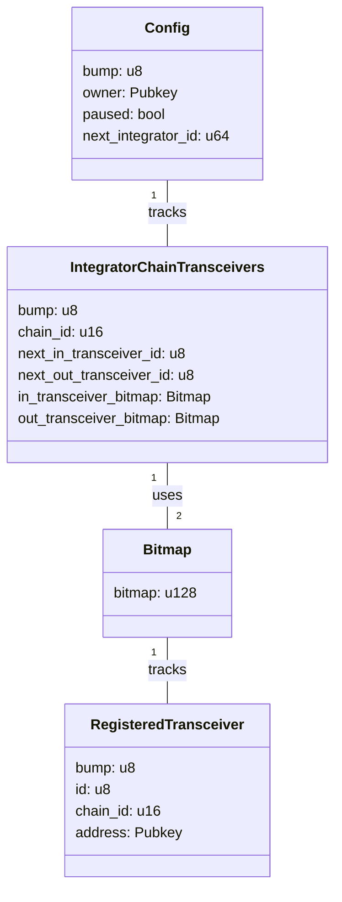

# GMP Router

## Project Structure

### Key Components

1. **Config**: Stores global configuration for the GMP Router.

   - Tracks the program owner, pause state, and integrator ID counter.
   - Singleton account created during program initialization.

2. **IntegratorChainTransceivers**: Manages transceivers for a specific integrator on a particular chain.

   - Uses bitmaps for efficient storage and lookup of transceiver statuses.
   - Maintains separate counters for incoming and outgoing transceivers.

3. **RegisteredTransceiver**: Represents a registered transceiver in the GMP Router.

   - Associated with a specific integrator and chain.
   - Has a unique ID within its integrator and chain context.

4. **Bitmap**: Utility struct for efficient storage and manipulation of boolean flags.
   - Used to track the status of transceivers (active/inactive).

### Relationships

- The Config account tracks multiple IntegratorChainTransceivers.
- Each IntegratorChainTransceivers account is associated with a specific integrator (identified by their public key) and chain.
- IntegratorChainTransceivers use two Bitmaps to efficiently track incoming and outgoing transceiver statuses.
- Each Bitmap tracks multiple RegisteredTransceivers.
- RegisteredTransceivers are associated with a specific integrator (via public key) and chain.

This structure allows for efficient management of multiple integrators, chains, and transceivers within the GMP Router system. It provides a scalable and flexible architecture for handling cross-chain message passing.

For detailed documentation on each component and its methods, please refer to the source files and generated API documentation.
